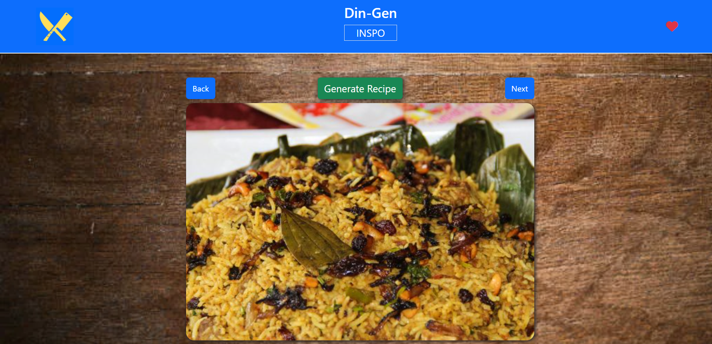
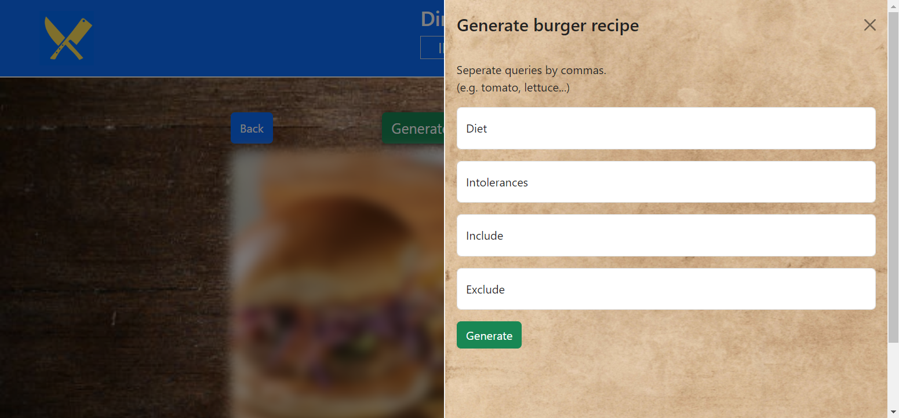
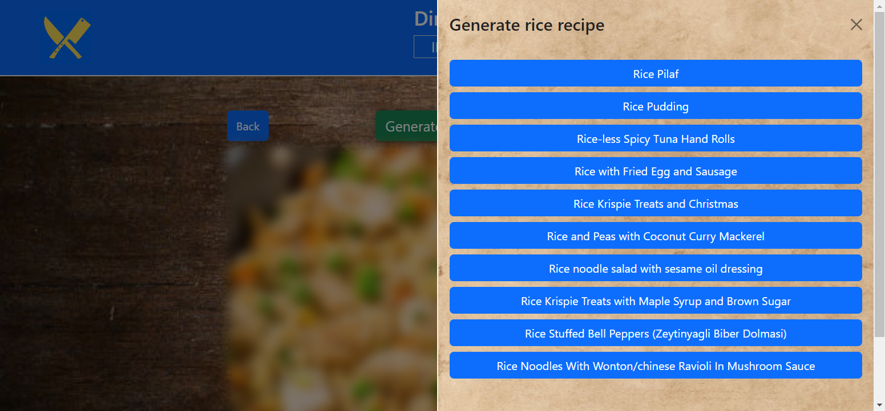
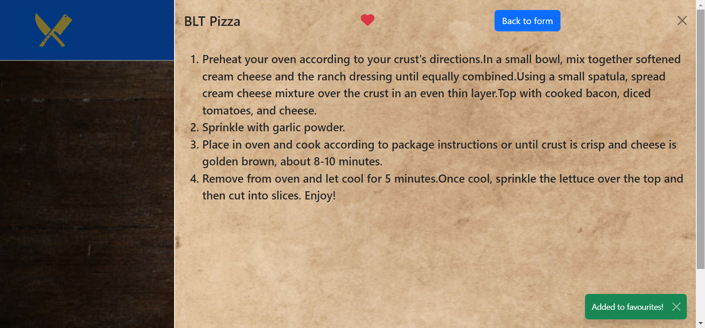
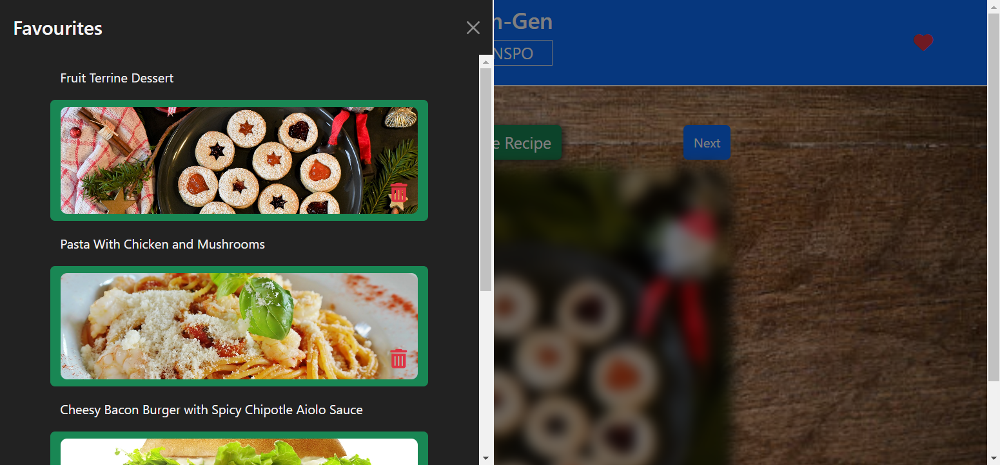

# Din-Gen INSPO

A group project that generates random images of popular food and generates recipes based on that category and user inputs.

[**Deployed Project**](https://jspitfire.github.io/Dinner-generator/)

##

### Usage

- Click "Next" button to generate image.
- Click "Back" to go back to previous images viewed.
- To generate recipe click "Generate Recipe" and a form will pop up.
- - Then imput dietry requierments in the form if needed.
- - Next, click "generate" button and a list of recipes will appear.
- - Lastly, click on a recipe and the steps will be rendered for you.
- To save to favourites, simply click on the "heart" icon when viewing the generated recipe.
- To open favourites list, click on "heart" icon in the navbar.
- To delete favourite items, simply click on the "bin" icon when viewing favourites list

##

### Techonologies

- [**jQuery**](https://jquery.com/)
- [**Bootstrap**](https://getbootstrap.com/)
- [**Figma**](https://figma.com/)
- [**Canva**](https://www.canva.com/)

##

### Resources

- [**W3 School**](https://www.w3schools.com/)
- [**MDN Web Docs**](https://developer.mozilla.org/)

##

### Desktop

##

### Form

### List

### Recipe

### Favourites

